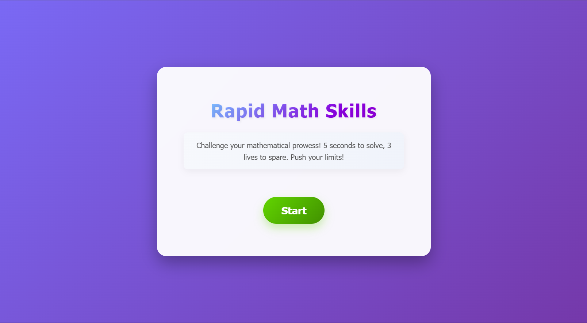

## lang use
* HTML
* CSS
* JavaScript
## Website appearance
**Website appearance on Desktop,Laptop,Tablet**

**Website appearance on Phone,Mini Size Tablet**

## How to Play:

1. Press the "Start Game" button to begin.
2. Answer the math questions displayed on the screen within 5 seconds.
3. If you answer correctly, you'll earn points.
4. If you answer incorrectly or run out of time, you'll lose 1 life.
5. The game ends when you lose all 3 lives.
6. View your score and a motivational quote after the game ends.
7. Press the "Play Again" button to restart the game.

## Developed by
* [MASTER T](https://github.com/MASTER-TANKHUN)